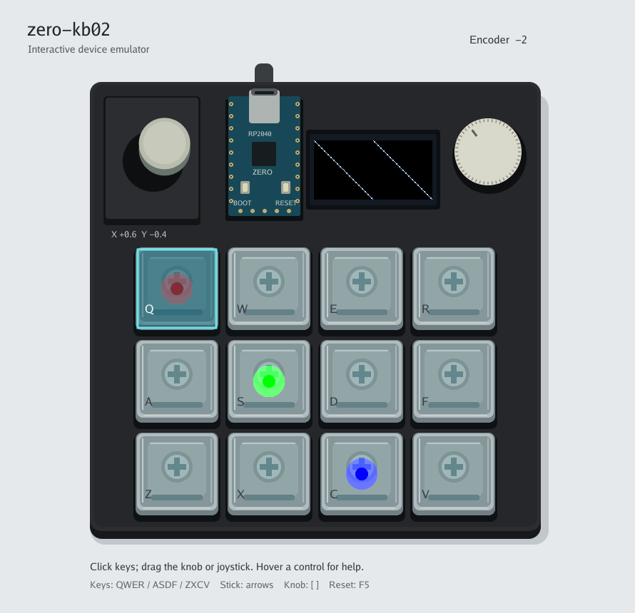

# rp2040-simulator

RP2040ボード向けTinyGoアプリを、実機へ書き込まずにPCで動かすためのエミュレータです。現在はzero-kb02に対応しています。デスクトップではローカルRPC、TinyGoでは実ドライバへ接続します。



SSD1306 OLED、キーLED、ロータリーエンコーダ、ジョイスティック、BOOT / RESETを画面上で操作できます。RP2040やGPIO / I2C / SPI自体はエミュレートしません。

## Usage

Go moduleをアプリへ追加します。

```sh
go get github.com/rin2yh/rp2040-simulator@latest
```

PCとTinyGoで共通に使えるpackageと最小構成のアプリは、[LED blink example](examples/led-blink)を参照してください。

## Development

### Setup

[mise](https://mise.jdx.dev/) をインストールしてから、開発ツールをセットアップします。

```sh
mise install
```

### Commands

```sh
mise run run         # エミュレータを起動
mise run check       # テストと静的検査
mise run test-gui    # GUIのgolden imageテスト
mise run screenshot  # GUIのスクリーンショットを生成
mise run build       # PC向けバイナリをビルド
```

## License

[MIT License](LICENSE)
